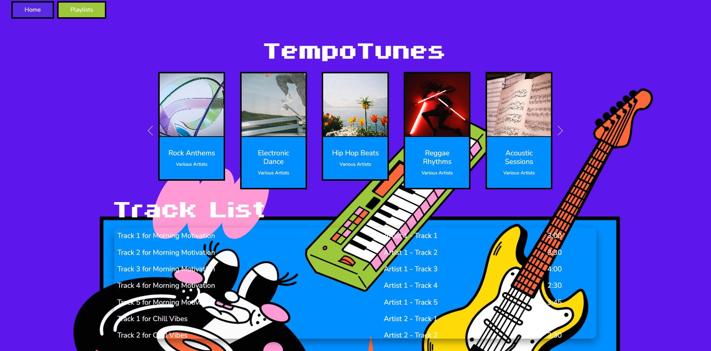

# Tempo Tunes Music Management Platform

## Managing Your Music Platform Has Never Been Easier—or Prettier

Take control of your music collection with TempoTunes’ sleek interface and powerful playlist tools—effortless creation, organization, and sharing, all wrapped in a beautiful, responsive design.

## Live Demo

Experience TempoTunes in action: [https://tempotunes-ezgxenenf5fnc4aj.westus-01.azurewebsites.net/](https://tempotunes-ezgxenenf5fnc4aj.westus-01.azurewebsites.net/)



## Features

- **Playlist Management**: Create, and delete playlists with custom cover images  
- **Track Management**: Add, view, and remove tracks within playlists—specify title, artist, and duration  
- **Home Dashboard**: Browse all playlists in a Bootstrap carousel and see a consolidated track list below  
- **Single Playlist View**: Drill down into any playlist to view its details and track lineup  
- **Modal‑Based Actions**: Use Bootstrap modals for adding/removing playlists and tracks without full page reloads  
- **Responsive Design**: Fully responsive UI across desktop and mobile devices  
- **Scrollable Track Lists**: Compact, scrollable containers with hidden scrollbars for a clean look  
- **Dynamic Theming**: Per‑view background colors/images and a sticky footer artwork element  
- **N‑Layer Architecture**: Clear separation between Controller → Service (Business) → DAO (DataAccess) layers, wired via dependency injection  
- **Azure‑Ready Configuration**: Environment‑driven settings and connection strings for seamless deployment to Azure App Service  

## Repository Structure
```
CST-326TempoTunes/
├── Controllers/                # Contains controller classes
│   └── HomeController.cs       # Handles homepage and related views
├── Helpers/                    # Custom HTML helpers
│   └── HtmlHelpers.cs          # Defines helper methods for views
├── Models/                     # Data models for views and logic
│   ├── ErrorViewModel.cs       # Model for error handling
│   ├── HomeViewModel.cs        # Model for home page data
│   ├── PlaylistModel.cs        # Model for playlist data
│   └── TrackModel.cs           # Model for track data
├── Properties/                 # Project properties (e.g., configuration)
├── Services/                   # Business logic
│   └── Business/               # Handles playlist business logic
│       └── PlaylistCollection.cs # Manages playlist collection
├── DataAccess/                 # Data access layer
│   └── PlaylistDAO.cs          # Interacts with the playlist database
├── Views/                      # Views for rendering pages
│   ├── Home/                   # Home page views
│   │   ├── Index.cshtml        # Home page
│   │   ├── OnePlaylist.cshtml  # Displays a single playlist
│   │   └── Playlist.cshtml     # Displays playlist list
│   └── Shared/                 # Shared view components
│       ├── Error.cshtml        # Common error page
│       ├── _Layout.cshtml      # Layout template for pages
│       ├── _Layout.cshtml.css  # Layout-specific CSS
│       ├── _ValidationScriptsPartial.cshtml # Validation scripts
│       ├── _ViewImports.cshtml # Shared imports for views
│       └── _ViewStart.cshtml   # Common view start settings
├── wwwroot/                    # Static files (CSS, JS, images)
├── .DS_Store                   # MacOS system file (ignore in version control)
├── CST-326TempoTunes.csproj    # Project file with dependencies
├── Program.cs                  # Application entry point
├── appsettings.Development.json # Development-specific settings
├── appsettings.json            # General app configuration
├── global.json                 # .NET SDK version
├── .gitattributes              # Git file handling rules
├── .gitignore                  # Specifies files Git should ignore
└── CST-326TempoTunes.sln       # Visual Studio solution file

```
